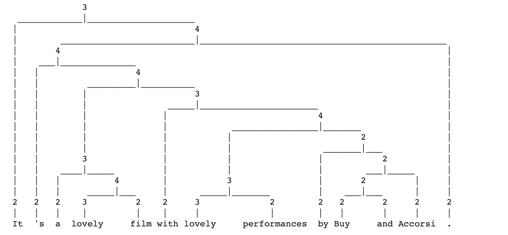
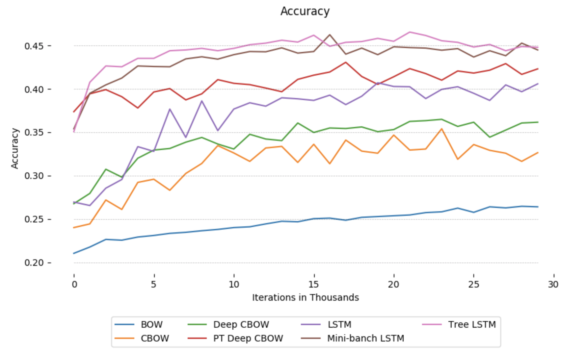
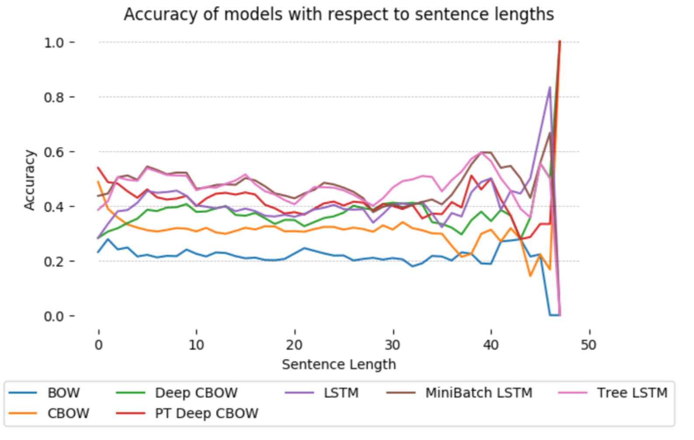

# Natural Language Processing

## Description
Welcome to our Natural Language Processing Projects reposetory! Here you will find various projects that are related to NLP tasks.

## Practical 1: Sentiment Detection of Movie Reviews

This practical concerns sentiment detection of movie reviews. 

We cover the following approaches:
- Symbolic approach – sentiment lexicon
- Naive Bayes
- Support Vector Machines 

You can fing the jupyter file with the code [here](practical_1/NLP1_Practical_I.ipynb).

## Practical 2: Encoding Sentences with Neural Models

In this practical we will train neural models to encode sentences, after which we can use our sentence representation for a downstream task such as sentiment classification.

For the first part of this practical we will only make use of the tokens, but in the end we will also exploit the tree-structure that is provided!

We will make use of the [Stanford Sentiment Treebank](https://nlp.stanford.edu/sentiment/) (SST), which provides sentences, their tree structure, and (fine-grained) sentiment scores.
This dataset is different from the one we used in the first practical. 
Before, a review consisted of several sentences, and we would have one sentiment score for it. Now, a review is a single sentence, for which we get a sentiment score. The special thing about our new data set is that we get a binary parse tree for each sentence, and a sentiment score has been assigned to each node in the tree.

  

    Tree structure of a review.

We cover the following approaches:
- Bag-of-words (BOW)
- Continuous bag-of-words (CBOW)
- Deep continuous bag-of-words (Deep CBOW)
- LSTM
- TreeLSTM

#### Results

  
  

    Accuracy results of the models.

- [Code](practical_2/NLP1_Practical_II.ipynb) and  [report](practical_2/report.pdf).

###### _Acknowledgement - References_

_The majority of the projects come from the lab assignments of the [Natural Language Processing 1](http://coursecatalogue.uva.nl/xmlpages/page/2018-2019-en/search-course/course/63075) course of the MSc in Artificial Intelligence at the University of Amsterdam._